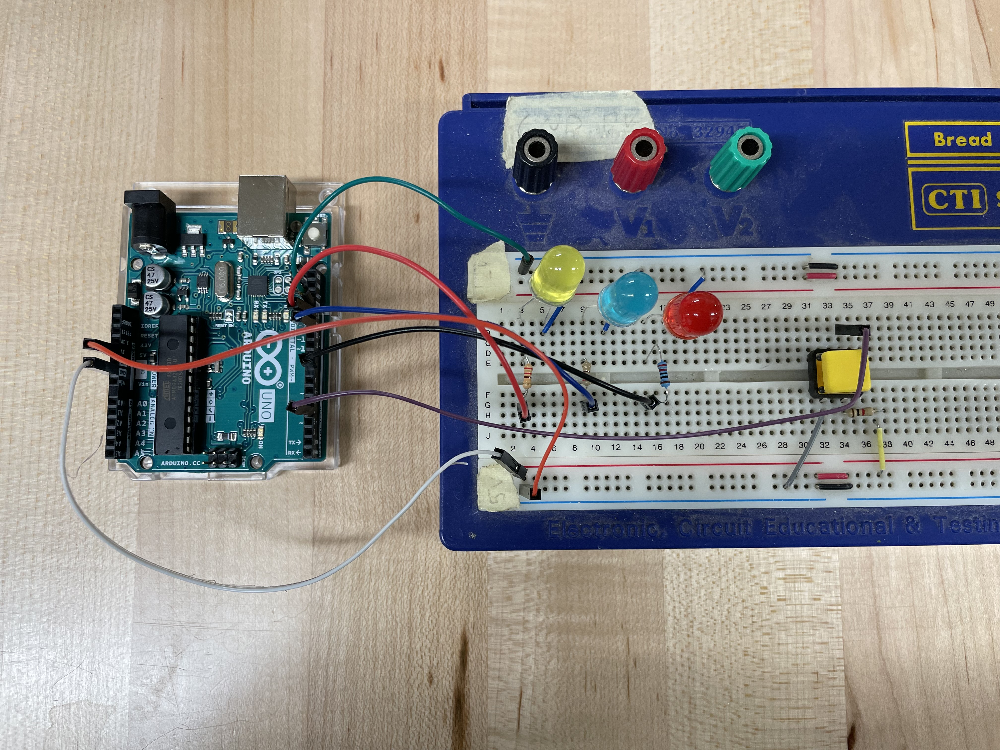
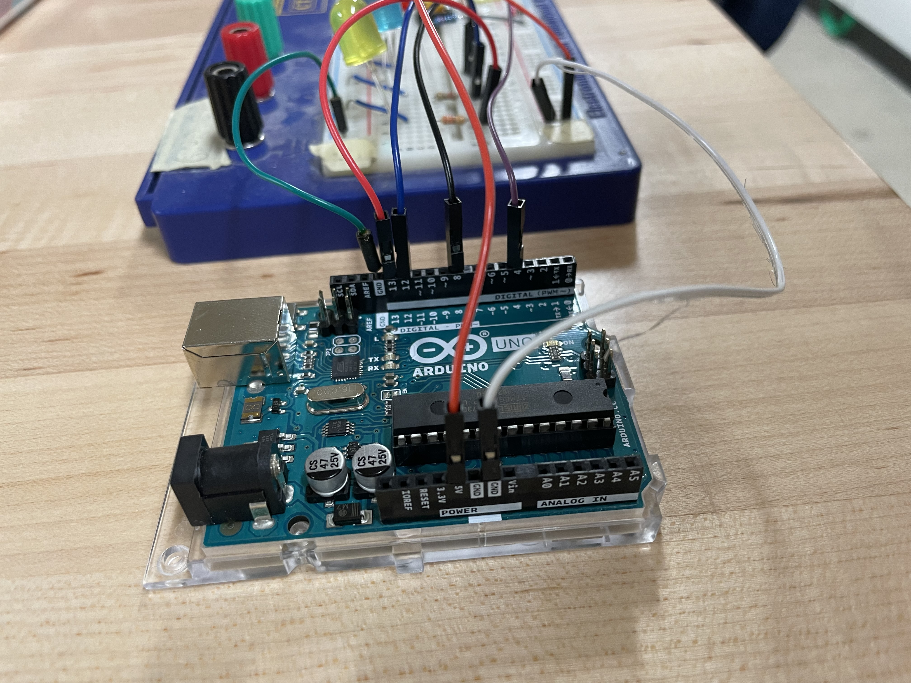
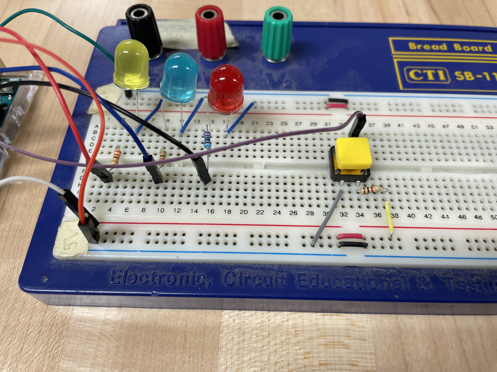

# desk-status-indicator
Arduino project to indicate whether you are free to chat. Developed by Emily.

# Using the indicator
- Connect your device to your computer with the USB cable
- It should automatically turn on
- Press the button repeatedly to cycle through the LED lights (Green = ok to talk, Yellow = can talk if needed, Red = don't talk to me)
- Turn off the device by unplugging from your computer

# Making changes
You can add more functionality by changing the software loaded onto the device.
- Install the [Arduino IDE](https://www.arduino.cc/en/software)
- Clone this repo
- Open this repo in the Arduino IDE
- Connect your board to your computer with the USB cable
- Add a new script to this repo with your desired changes
- Upload your new script to the board
- It should automatically update and run while your device is plugged in.

# Wiring diagrams
These diagrams are using the Arduino Uno, which is not the final controller to be used in this project.

